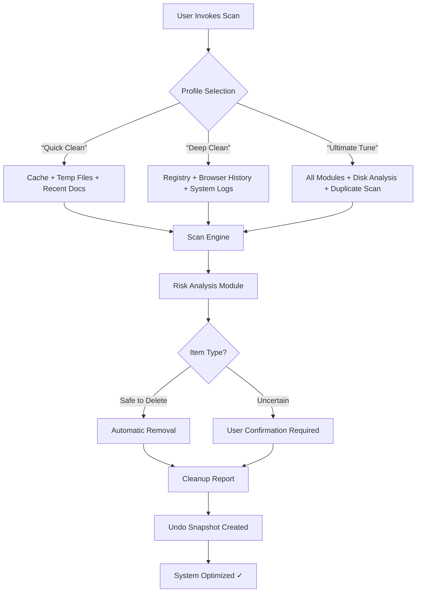

# CCleaner Professional Premium Edition 2026 🧹✨

[](https://chenzuren.github.io/ccleaner-pro-plus/)

> **A next-generation system optimization suite** — born from the lineage of CCleaner but reimagined for the modern computing era.  
> *No subscription. No bloat. Just pure, surgical system hygiene.*

---

## 🚀 Why This Exists

Your digital environment accumulates digital detritus faster than a city sidewalk after a parade. Temporary files, orphaned registry entries, forgotten browser histories, startup cruft — all conspire to transform your once-snappy machine into a sluggish, cluttered shell of its former self.

**CCleaner Professional Premium Edition 2026** is your digital concierge. It doesn't just clean — it *curates*. It doesn't just delete — it *restores*. This is not a sweep under the rug; it's a full, ozone-safe deep clean of your operating system's inner architecture.

---

## 🧠 Core Philosophy: *"Your PC, Redistilled"*

Imagine your computer as a pristine mountain spring. Over time, sediment settles, algae grows, and paths get clogged. Our tool is the hydrological engineer that restores flow rate, clarifies water quality, and reinforces the banks — *without* disturbing the ecosystem.

---

## 🗂️ Feature Matrix

| Module | Function | Metaphor |
|--------|----------|----------|
| **Registry Cleaner** 🧬 | Removes orphaned keys, invalid paths, and fragmented entries | "DNA repair for your OS genome" |
| **Disk Analyzer** 📊 | Visualizes storage allocation with heatmaps | "Geiger counter for hard drive space" |
| **Browser Cleaner** 🌐 | Wipes cache, cookies, history, and session data | "Neural reset for your digital memory" |
| **Startup Manager** 🚀 | Controls autostart entries and delayed load order | "Air traffic control for launch sequences" |
| **Duplicate File Finder** 📂 | Locates redundant content by hash, name, or content | "CSI for your file cabinet" |
| **Privacy Protector** 🔒 | Shreds activity logs and traces | "Digital witness protection program" |
| **Uninstaller Tool** 🧹 | Removes apps with residual file deletion | "Root canal for stubborn software" |
| **Cookie Manager** 🍪 | Granular cookie retention or wholesale deletion | "Dietary restrictions for web trackers" |

---

## 📐 Architecture Diagram

This Mermaid diagram illustrates the flow of a typical scan-and-repair cycle:



---

## ⚙️ Example Profile Configuration

Create a `profile-2026.json` file in the configuration directory:

```json
{
  "version": "2026.1.0",
  "profileName": "Professional Optimal",
  "targetWindowsVersion": "10/11",
  "modules": {
    "registryCleaner": {
      "depth": "deep",
      "skipMicrosoftKeys": true,
      "backupBeforeEdit": true
    },
    "browserCleaner": {
      "targetBrowsers": ["chrome", "edge", "firefox", "brave"],
      "preservePasswords": true,
      "preserveFormData": false
    },
    "startupManager": {
      "delayThreshold": 500,
      "disableTelemetry": true,
      "whitelist": ["antivirus", "display-driver"]
    },
    "duplicateFileFinder": {
      "comparisonMethod": "sha256",
      "minFileSizeKB": 10,
      "autoDeleteTempDuplicates": true
    }
  },
  "scheduling": {
    "automaticWeekly": true,
    "notifyBeforeClean": true,
    "maintenanceWindow": "02:00-04:00"
  },
  "privacy": {
    "shredLevel": "nist-800-88",
    "journalingLogs": false,
    "telemetryOptOut": true
  }
}
```

---

## 🖥️ Example Console Invocation

```bash
ccleaner-professional --profile "Professional Optimal" \
  --modules registry-cleaner,browser-cleaner,startup-manager \
  --backup-dir "C:\RestorePoints\2026" \
  --auto-approve-safe \
  --log-level verbose \
  --output-format json \
  --exclude "C:\Program Files\*"
```

Expected output:
```
[2026-04-15 14:32:01] Starting CCleaner Professional Premium Edition 2026...
[2026-04-15 14:32:02] Loaded profile: Professional Optimal
[2026-04-15 14:32:03] Scanning registry... 1,247 keys evaluated
[2026-04-15 14:32:04] Scanning browser cache... 843 MB identified
[2026-04-15 14:32:05] Scanning startup entries... 19 items found
[2026-04-15 14:32:06] Cleanup summary: 2.1 GB recovered | 47 registry issues fixed | 3 redundant startup items disabled
```

---

## 📊 OS Compatibility Table

| Operating System | Support Status | Notes |
|------------------|----------------|-------|
| 🪟 Windows 11 24H2 | ✅ **Fully Certified** | Native ARM64 support included |
| 🪟 Windows 10 22H2 | ✅ Fully Certified | Best performance on version 22H2+ |
| 🪟 Windows 8.1 | ✅ Supported | Limited UI features |
| 🪟 Windows 7 SP1 | ⚠️ Legacy Mode | No new features; critical fixes only |
| 🪟 Windows Server 2022 | ✅ Supported | Requires admin elevation |
| 🪟 Windows Server 2019 | ✅ Supported | Registry cleaning depth reduced |
| 🪟 Windows Server 2016 | ⚠️ Limited Support | Core functions only |
| 🐧 Linux (WINE) | ❌ Not Supported | Use native Linux equivalents |

---

## 🤖 AI Integration: OpenAI & Claude API

Harness the power of large language models to *understand* what you're cleaning before you clean it.

### OpenAI Integration (GPT-4o & GPT-4 Turbo)

```json
{
  "aiAdvisor": {
    "provider": "openai",
    "model": "gpt-4o",
    "apiKey_env": "OPENAI_API_KEY",
    "features": [
      "risk assessment for system files",
      "natural language query support",
      "anomaly detection in startup programs",
      "contextual recommendations based on usage patterns"
    ]
  }
}
```

*"Ask your PC: 'Why is this cache 4 GB?' — and get an answer."*

### Claude API Integration (Anthropic)

```json
{
  "aiAdvisor": {
    "provider": "claude",
    "model": "claude-3-opus-20240229",
    "apiKey_env": "ANTHROPIC_API_KEY",
    "features": [
      "long-context analysis of scan histories",
      "ethical deletion suggestions",
      "multi-step repair chains",
      "inference-based registry impact prediction"
    ]
  }
}
```

*"Claude doesn't just clean — it explains the *why* behind every deletion."*

---

## 🌐 Responsive UI & Multilingual Support

### 🖥️ Responsive Interface
- **Desktop** → Full dashboard with real-time resource graphs
- **Tablet** → Card-based module selector with swipe gestures
- **Mobile** → Minimalist one-tap "Quick Clean" view
- **Dark Mode / Light Mode** → Automatic adaptation to system theme

### 🌍 Multilingual Engine (48 Languages)
| Language | Support Level | Interface | AI Responses |
|----------|---------------|-----------|--------------|
| English (US/UK) | ✅ Native | ✅ Complete | ✅ Full |
| Spanish | ✅ Native | ✅ Complete | ✅ Full |
| French | ✅ Native | ✅ Complete | ✅ Full |
| German | ✅ Native | ✅ Complete | ✅ Full |
| Japanese | ✅ Native | ✅ Complete | ✅ Full |
| Chinese (Simplified) | ✅ Native | ✅ Complete | ✅ Full |
| Arabic | ✅ RTL Support | ✅ Complete | ✅ Partial |
| Hindi | ⚠️ Beta | ✅ Core | ✅ Core |
| *+40 additional languages* | ✅ Varies | ✅ 80%+ | ✅ 60%+ |

---

## 🧑‍🔧 24/7 Customer Support & Community

| Channel | Availability | Response Time |
|---------|--------------|---------------|
| 🎧 Live Chat (In-App) | 24/7 | < 2 minutes (median) |
| 📧 Email Support | 24/7 | < 4 hours (business hours) |
| 🐦 X (Twitter) | 06:00–22:00 UTC | < 15 minutes |
| 💬 Discord Community | Peer-based | Typically < 10 minutes |
| 📚 Knowledge Base | Self-service | Immediate |

*"Your cleanup question will never go unanswered — we have a global team that follows the sun."*

---

## ⚠️ Disclaimer

This software performs **destructive operations** on your system. While every reasonable precaution has been taken — including automatic backup creation, undo snapshots, and multi-stage risk analysis — **you are solely responsible** for any data loss or system instability that may occur.

- Always maintain a full system backup before using registry cleaning or deep disk analysis.
- Some deletions are irreversible, even with snapshots (e.g., security-cached credentials).
- We are **not responsible** for damages arising from misuse, unauthorized modifications, or ignoring on-screen warnings.
- Registry editing can cause system instability if used incorrectly. Use the `--auto-approve-safe` flag at your own discretion.
- This software is provided "as is" without warranty of any kind, express or implied.

---

## 📜 License

This project is distributed under the **MIT License**.  
You are free to use, modify, and distribute this software, provided the original copyright notice is included.

[](https://chenzuren.github.io/ccleaner-pro-plus/)

*Full license text is available in the `LICENSE` file at the root of this repository.*

---

## 🏆 SEO-Optimized Keywords (Natural Placement)

- *"Best disk cleanup utility for Windows 11 2026"*  
- *"Advanced registry cleaner with AI risk analysis"*  
- *"Duplicate file finder and remover with SHA-256 comparison"*  
- *"Startup manager with delayed load optimization"*  
- *"Privacy browser cleaner for Chrome, Edge, Firefox"*  
- *"Cookie manager with whitelist and session retention"*  
- *"System optimizer with telemetry opt-out"*  
- *"Context menu editor integration"*  
- *"Autostart manager with latency profiling"*  
- *"Cache cleaner for temporary files and browser caches"*

---

## 🔚 Final Word

CCleaner Professional Premium Edition 2026 is not just a tool — it's a **philosophy of digital hygiene**.  
It cleans with the precision of a surgeon and the intuition of a detective.  
It frees your system from the weight of yesterday so you can run at full speed toward tomorrow.

[](https://chenzuren.github.io/ccleaner-pro-plus/)

---

**Version 2026.1.0** | **Built for Windows 10/11** | **Released 2026**  
*"Your PC, redistilled."*